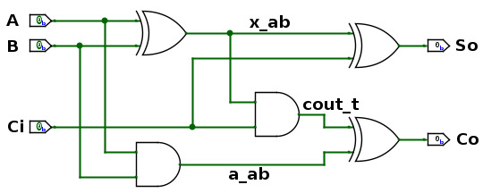
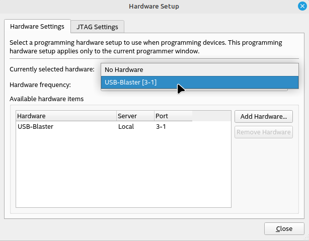

## Sumador de 1 bit

El objetivo de este laboratorio es que los estudiantes se familiaricen con el entorno de desarrollo Quartus y la herramienta de simulación mediante la descripción del circuito sumador de 1 bit.


## Sumador completo.

Se le llama sumador completo a un circuito digital utilizado en aritmética binaria que permite hacer sumas entre dos números binarios y un bit de acarreo, obteniendo como salida, el resultado de la suma y un bit de acarreo de salida. A continuación se presenta la tabla de verdad del sumador completo de un bit.

|   A  |   B  |  Ci |   Co  |   So  |
|------|------|-----|-------|-------|
|   0  |   0  |  0  | **0** | **0** |
|   0  |   0  |  1  | **0** | **1** |
|   0  |   1  |  0  | **0** | **1** |
|   0  |   1  |  1  | **1** | **0** | 
|   1  |   0  |  0  | **0** | **1** |
|   1  |   0  |  1  | **1** | **0** |
|   1  |   1  |  0  | **1** | **0** |
|   1  |   1  |  1  | **1** | **1** | 

A partir de la tabla de verdad, mediante **mapas de Karnaugh**, se obtienen las expresiones para las salidas del sumador de 1 bit, las cuales son:


Estas expresiones se ven implementadas en el siguiente circuito:



Ahora tenemos que dadas las especificaciones del sumador completo de 1 bit, se puede  obtener el diagrama de bloque como sigue:

{width=40%}

## **Tutorial de implementación en la FPGA Cyclone IV**:

***Partes y conexiones***


### **Configuración del programador (USB-blaster) de la FPGA**:

### **1. Linux**:
----------------------------------------------------------------


***udev - Gestor Dinámico de Dispositivos Linux***: 

```udev``` es un sistema de espacio de usuario (se refiere a un espacio de aplicación, parcialmente en Unix o en sistemas operativos tipo Unix, el cual es externo al núcleo) que permite al administrador del sistema operativo registrar controladores de espacio de usuario para eventos. Estos eventos son generados principalmente por el kernel de Linux en respuesta a eventos físicos relacionados con dispositivos periféricos, en este caso el USB-blaster de la FPGA, permitiendo identificar dispositivos de forma dinámica en función de sus propiedades, como la ID del proveedor y la ID del dispositivo.

### **Cómo crear una regla ```udev``` para el USB-blaster de la FPGA**:

 * Existe una carpeta de reglas ```udev ``` en el directorio ```root```, para acceder a este se debe:

```
cd /
cd etc/udev/rules.d/
```

 * Una vez en este directorio, con el comando ```sudo``` (porque estamos en un directorio ```root```) se debe crear un archivo con el nombre **51-usbblaster.rules** así:

```
sudo touch 51-usbblaster.rules
```

Con el comando anterior se creó un arhivo ```.rules``` vacío.

* Ahora se deben agregar las siguientes líneas dentro de ese archivo, para lo cual se puede hacer de dos formas:

  - Abrir en el directorio ```rules.d``` el editor de texto de preferencia, por ejemplo para VSC el comando ```code .``` abrirá el editor en dicha ubicación, en donde verá en la barra EXPLORER el archivo ```.rules``` creado junto a otros archivos y podrá editarlo agregando las siguientes líneas, pero, cuando lo intente guardar, VSC le solictará permiso para hacerlo como super usuario (sudo).

  - Con el comando ```sudo nano 51-usbblaster.rules``` abrirá el archivo creado anteriormente en la terminal y podrá agregar las siguientes lineas.

```
# Intel FPGA Download Cable

SUBSYSTEM=="usb", ATTR{idVendor}=="09fb", ATTR{idProduct}=="6001", MODE="0666"

SUBSYSTEM=="usb", ATTR{idVendor}=="09fb", ATTR{idProduct}=="6002", MODE="0666"

SUBSYSTEM=="usb", ATTR{idVendor}=="09fb", ATTR{idProduct}=="6003", MODE="0666"

# Intel FPGA Download Cable II

SUBSYSTEM=="usb", ATTR{idVendor}=="09fb", ATTR{idProduct}=="6010", MODE="0666"

SUBSYSTEM=="usb", ATTR{idVendor}=="09fb", ATTR{idProduct}=="6810", MODE="0666"

```

* Una vez creadas las reglas para el USB-blaster de la FPGA el siguiente comando actualizará dichas reglas en el sistema:

```
udevadm control --reload-rules
```

* Poterior a esto se debe hacer un *reboot* del computator.


### **2. Windows**:
----------------------------------------------------------------

1. Se debe conectar el USB-Blaster al computador.

2. Abrir el ```Device Manager```.

3. Bajo **Other devices** &rarr; **Unknown device** se encontrará el USB-blaster.

4. Click derecho sobre este dispositivo y seleccionar **Update driver**.


5. Seleccionar **Browse my computer for driver software**.

6. Buscar el driver en ```Path de la instalación de Quartus\quartus\drivers\usb-blaster-ii```.

7. Click en **Next**.

8. Seleccionar **Install** en la ventana **Would you like to install this device software?**

9. Al finalizar deberá aparecer una ventana confirmando la instalación exitosa del driver.

10. Finalmente, en el ```Device Manager``` ya no aparecerá el USB-blaster como un dispositivo desconocido (**Unknown device**).


(Tutorial para Windows tomado de [link](https://www.terasic.com.tw/wiki/Intel_USB_Blaster_II_Driver_Installation_Instructions))

### **Implementación del sumador de 1 bit**:
----------------------------------------------------------------

* Abrir el proyecto previamente creado para el sumador de 1 bit en *Quartus*.

* En la sección ```Project Navigator``` &rarr; ```Hierarchy``` hacer click derecho sobre el nombre del dispositivo como se muestra en la imagen y seleccionar la opción **Device**.


* Se abrirá la ventana ```Device``` en donde se debe seleccionar en **Family** la opción **Cyclone IV E** y en  **Available devices** seleccionar la referencia **EP4CE6E22C8** como se muestra en la imagen.


* Luego, en la sección ```Task``` se debe hacer click a la opción **Compile Design**.

* Posteriormente, en la barra **Standard** (que está debajo de la barra de menús), deben seleccionar el icono de **Pin Planer** que abrirá dicha ventana, donde se encontrará el pinout de la FPGA, como se muestra en las siguiente imagenes:


  - En la parte inferior de la ventana ```Pin Planer``` se puede observar una tabla con las entradas y salidas del diseño del sumador de 1 bit en la columna **Node name**.

  - En la columna **Location** se podrá seleccionar los pines de la FPGA asociados a ciertos elementos, en este caso, se van a usar switches para las entradas y leds para las salidas, dicha numeración se podrá observar directamente en la FPGA.

  - Posteriormente se debe dar doble click a la opción **Run I/O Assignment Analysis** que se encuentra en la sección ```Task```, en la parte izquierda de la ventana ```Pin Planer```.

* En la ventana principal de *Quartus*, se debe dar doble click en la opción **Program Device (Open Programmer)** que aparece en la sección ```Task```, que abrirá la ventana  ```Programmer``` como se muestra en la imagen.


* En la ventana  ```Programmer``` deben darle click al botón ```Hardware Setup``` que abrirá usa sub ventana en donde deben seleccionar el USB-blaster de la FPGA como se muestra en la imagen.




* Finalmente, en la ventana  ```Programmer``` deben darle click al botón ```Start``` que iniciará la programación de la FPGA, la cual pueden  observar en la barra de progreso (***No desconectar ni mover las conexiones a la FPGA mientras no vean la barra de progreso completada***) como se ve en la siguiente imagen.


* Con lo anterior se podrá interactuar con los tres switches seleccionados para cada una de las entradas del diseño y podrán corroborar el comportamiento del sumador de 1 bit con los leds.


